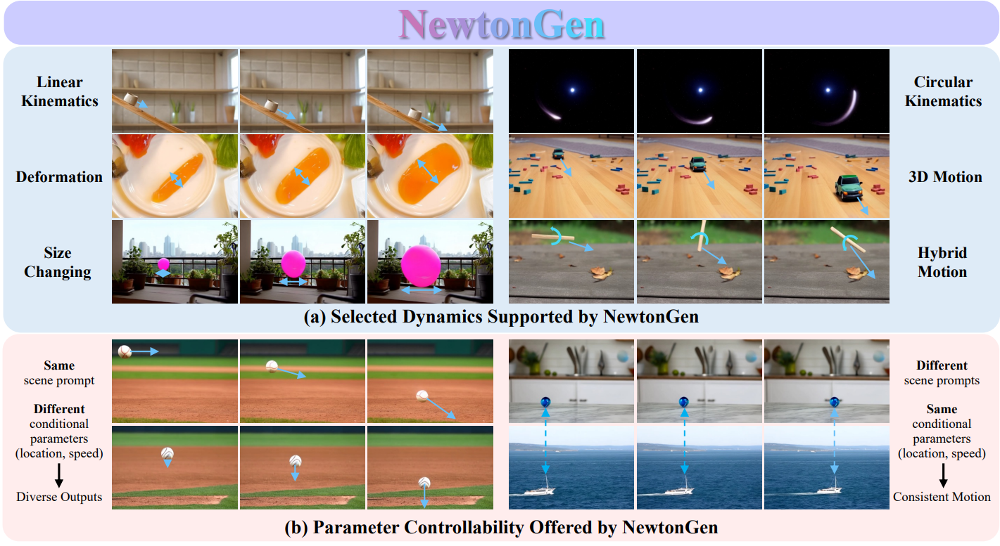

This repository is the official implementation of [NewtonGen](https://arxiv.org/abs/2509.21309).

> **NewtonGen: Physics-Consistent and Controllable Text-to-Video Generation via Neural Newtonian Dynamics** <br>
> [Yu Yuan](https://yuanyuspace.cn/about/), [Xijun Wang](https://xijun-w.github.io/), [Tharindu Wickremasinghe](https://tharindu-nirmal.github.io/), [Zeeshan Nadir](https://www.linkedin.com/in/zeeshan-nadir), [Bole Ma](https://engineering.purdue.edu/ChanGroup/people.html), [Stanley H. Chan](https://engineering.purdue.edu/ChanGroup/stanleychan.html)<br>

[](https://arxiv.org/abs/2509.21309)
[](https://fisheryu100.github.io/NewtonGen/)
[-Demo-FF4F1D.svg?style=for-the-badge&logo=Huggingface)](https://huggingface.co/spaces/pandaphd/generative_photography)

[](https://pytorch.org)
[](https://www.python.org)




## 🔥 Latest News!
* [Sep 29, 2025]: Create Project Page.
* [Sep 28, 2025]: Update the detailed README.
* [Sep 25, 2025]: Release the official code.
* [Sep 25, 2025]: Paper on arXiv.


## Configurations
<details>
<summary>Click to expand</summary>

### 1. Environment
* CUDA 12.6, 64-bit Python 3.10 and PyTorch 2.5.1, other environments may also work
* Users can use the following commands to install the packages
```bash
conda create -n newtongen python=3.10
pip install torch==2.5.1 torchvision==0.20.1 torchaudio==2.5.1
conda activate newtongen

cd 'where_you_clone_NewtonGen' 
pip install -r requirements.txt
```


### 2. Prepare Models and Weights
There are 3 types of weights you need to download/prepare.
1. Download CogVideoX-5B and  pre-trained weights from [Hugging Face](https://huggingface.co/zai-org/CogVideoX-5b/tree/main)
2. The lora weight from Go-with-the-Flow: [T2V5B_blendnorm_i18000_DATASET_lora_weights.safetensors](https://huggingface.co/Eyeline-Labs/Go-with-the-Flow/tree/main)
3. The learned ODE weights for different dynamics: already in our folder `learned_dynamics`

</details>

## Inference
<details>
<summary>Click to expand</summary>

### 1. Choose the Motion You Need

- **Linear motions** (uniform motion, acceleration, deceleration, 3D motion, slope sliding, parabolic motion)  
  Use `inference_linear_withprompts.py` since the object can be treated as a whole when rendering optical flow.

- **Other motions** (rotation, size changing, parabolic motion with rotation, damped oscillation)  
  These require separate handling because different parts of the object move in different directions. Each has its own inference script.

### 2. Modify the Models and Weights Root
Set all the *MODEL_PATH*, *sample_path=sample_path*, *output_mp4_path* and other roots to your own ones in the `inference_xx.py` 


### 3. Modify the Configuration and Prompts
Change the Z0 dict in *config_list* according to your need. Tips: set the size-related *s* *l* larger will have a better visual effect.
```bash
config_list = [
    dict(
        z0=[6.9901, 9.3459, 5.558, -4.8493, 0.0, 0.0, 1.0, 2.0, 2.0], # x y vx vy theta omega s l a 
        DT=0.02,                                                      # delta time between each 2 frames
        METER_PER_PX=0.05,                                            # world size: 360*0.05 = 18m
        chosen_shape="circle",                                        # the nearest shape of the object
        output_name="set_a"
    ),
    ]
```

### 4. Run
```bash
python inference_xx.py
```

</details>

## Training for NND
<details>
<summary>Click to expand</summary>

### 1. Prepare Physics-Clean Videos
Run the scripts in folder `data_simulation`. We also provide the simulation samples in the folder.  
You can 

### 2. Encode the Physics-Clean Videos into Physical States Labels
Run the script in folder `physical_encoder`. For Circular Motion and Damped Oscillation, please use `phys_encoder_circular_oscillation.py`, all other motions, please use `phys_encoder.py`.

### 3. Training Example
Before you start NND training, set the *dynamics_batch*, other root paths, and hyper-parameters in the `train.py`, 
```bash
python train.py
```
You can prepare validation Physical States Labels from upper step 1, or you can ignore the validation part in the `train.py`.

</details>

## Evaluation
We calculated the Physical Invariance Score (PIS) for evaluation.
The code is in the `evaluation_PIS` folder. First run  `sam2_pipeline.py` to get masks, then use `masked_physical_features_pis.py`.


## Disclaimer
This project is released for academic use. We disclaim responsibility for user-generated content. Users are solely liable for their actions. The project contributors are not legally affiliated with, nor accountable for, users' behaviors. Use the generative model responsibly, adhering to ethical and legal standards. 


## ❣️ Acknowledgement
We thank [Go-with-the-Flow](https://github.com/Eyeline-Labs/Go-with-the-Flow) for their amazing jobs.


## 🌟 Citation
If you feel this project helpful/insightful, please cite our paper:
```bibtex
@article{Yuan_2025_NewtonGen,
  title={NewtonGen: Physics-Consistent and Controllable Text-to-Video Generation via Neural Newtonian Dynamics},
  author={Yuan, Yu and Wang, Xijun and Wickremasinghe, Tharindu and Nadir, Zeeshan and Ma, Bole and Chan, Stanley},
  journal={arXiv preprint arXiv: 2509.21309},
  year={2025}
}
```

## ✉️ Contact
If you have any questions or comments, feel free to contact me through email (mryuanyu@outlook.com). Suggestions and collaborations are also highly welcome!
